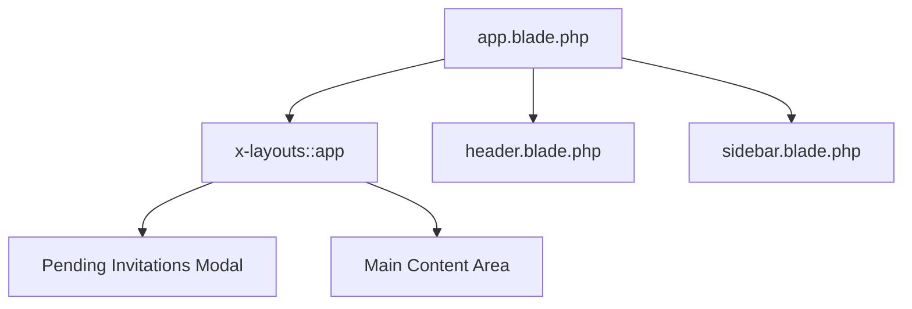

# Code Graph: View Structure and Data Flow

## Overview

This graph illustrates the relationship between views, components, and data sources used for displaying responses in the treasure hunt application.

## Main Layout Components



## Core Pages

### Dashboard
- **File**: `resources/views/dashboard.blade.php`
- **Key Data Source**: `Auth::user()->toUserTeams(includeCurrent: true)`
- **Components**: `livewire:pages::teams.pending-invitations-modal`
- **Purpose**: Display user's teams and pending invitations

### Teams Index
- **File**: `resources/views/pages/teams/⚡index.blade.php`
- **Key Data Source**: `Auth::user()->toUserTeams(includeCurrent: true)`
- **Components**: Team rows with role indicators, create/leave team modals
- **Purpose**: List all teams and manage membership

## Components

### Team Switcher
- **File**: `resources/views/components/⚡team-switcher.blade.php`
- **Functionality**: Handle team switching and member management
- **Integration**: Called from dashboard layout

### Auth Components
- **Files**: `components/auth-header.blade.php`, `components/auth-session-status.blade.php`
- **Purpose**: User authentication state display

## Data Flow Pattern

```
┌─────────────────┐
│   Controller    │
│   (Route Logic)│
└─────────┬───────┘
          ▼
┌─────────────────┐    ┌──────────────────┐
│   Livewire       │    │   Models         │
│   Components     │◄──►│   (Team, User)   │
│  (State Mgmt)    │    │                  │
└─────────────────┘    └──────────────────┘
          ▲                       │
          └─────────── Response ───┘
                    (JSON/HTML)
```

## Key Observations

1. **Single Responsibility**: Each page component focuses on a specific domain (teams, auth, dashboard)
2. **Data Aggregation**: All team listings use `Auth::user()->toUserTeams()` for centralized data retrieval
3. **Interactivity**: Livewire components handle real-time updates and user interactions
4. **Consistent Layout**: All pages use the main `x-layouts::app` wrapper

## Skill Recommendation

For creating pages with data display, use the **livewire-development** skill which covers:
- Creating Livewire components for dynamic data display
- Handling state management and user interactions
- Integrating with Laravel models for data persistence
- Building responsive UI components with Alpine.js/JS
